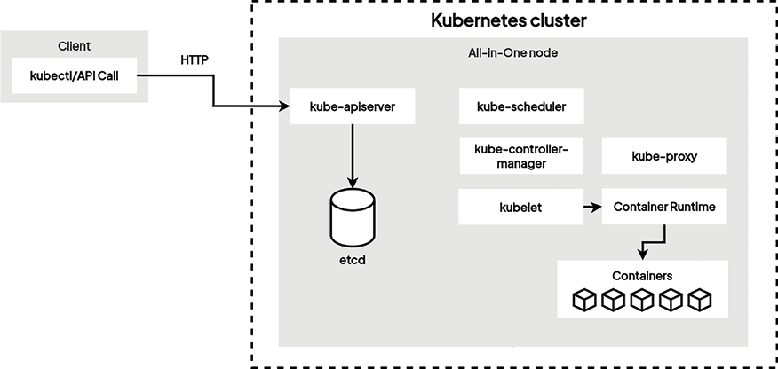
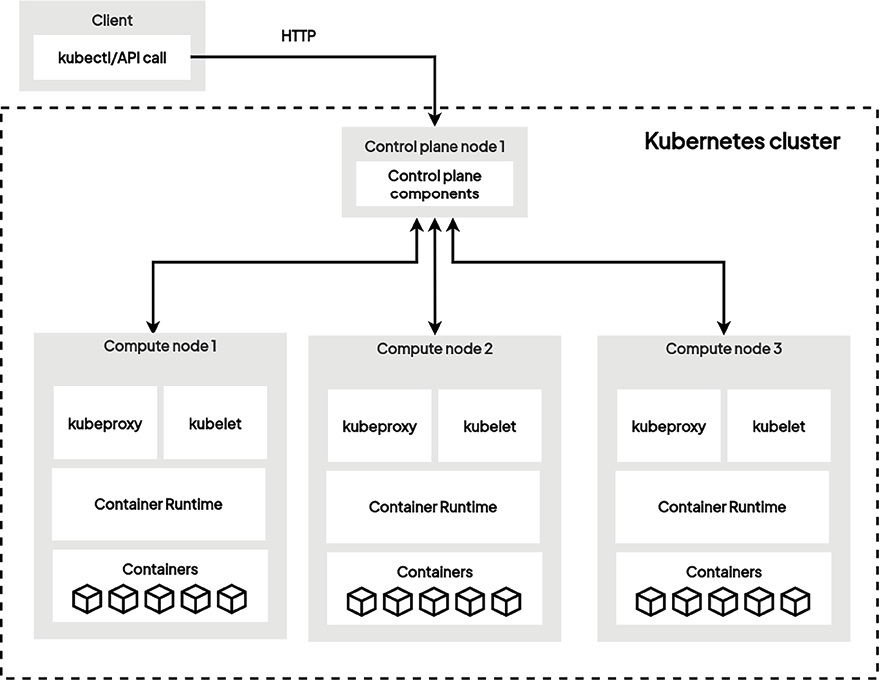
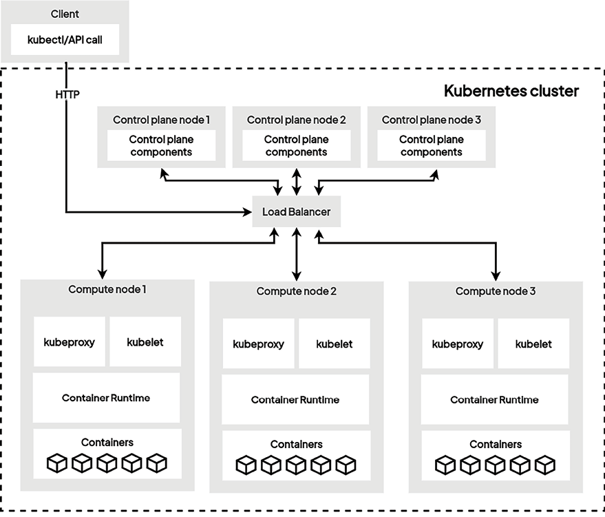
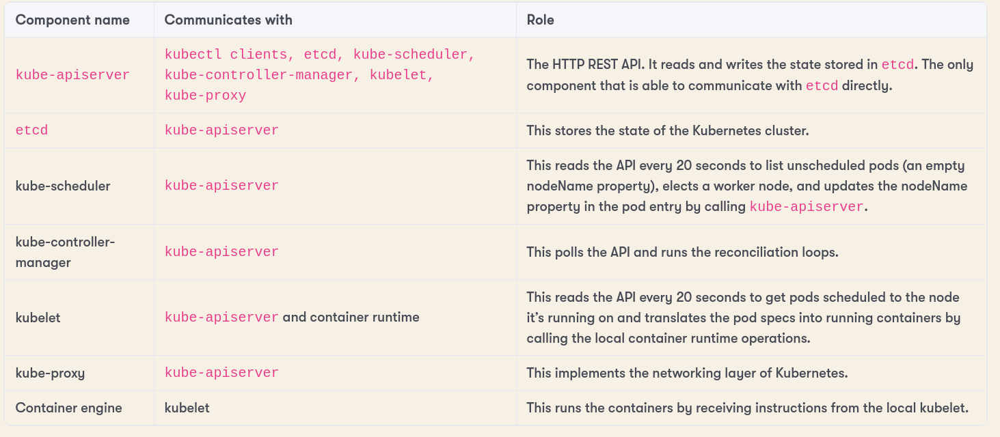

# Cluster Topologies and High Availability

## 1. Single-node cluster

Running all components on one machine/host is a bad idea, especially for production, but it's fine for testing.

The `minikube` tool makes it easy to set up a single-node k8s cluster on your machine. It is good for local tests, and a multi-node cluster is also possible.

**Cons:**

- can't scale
- not highly available
- not production-ready

## 2. Single-master cluster

One node executes all of the control plane components, with as many compute nodes as you want.

**Cons:**

- **Single point of failure.** If control plane node 1 fails, we can't communicate with the cluster. You would have to SSH into each node just to stop workloads via `ctr`, `crictl` or `docker` commands.
- **Single etcd.** If the control plane node is corrupted, we lose the dataset and cannot recover the cluster.
- **Control plane load.** If we add more compute/worker nodes, the control plane might have an outage, because each worker node adds a kubelet agent that polls `kube-apiserver` every 20 seconds.
- Not highly available.

## 3. Multi-master, multi-node cluster

The best way: **both the control plane and the compute nodes are replicated.**

- A **load balancer** is needed on top of the `kube-apiserver` instances to spread load evenly.
- Amazon and Google Kubernetes services provide multi-controller and multi-compute clusters.
- If we want, we can split the different control plane components across dedicated hosts. That's great, but it's not mandatory.

### How etcd stays consistent

With this approach, each control plane node runs an `etcd` instance. The instances communicate with each other to replicate the cluster state and ensure that all instances have the same data, using a consensus algorithm called **Raft**.

Raft ensures a **single leader at all times**, responsible for accepting writes to the cluster state and replicating the changes to the other instances. If the leader is unavailable, the other instances elect a new leader.

## Components cheat sheet

> 🧠 Memorize these components and their objectives.

| Component | Communicates with | Role |
|---|---|---|
| `kube-apiserver` | kubectl clients, etcd, kube-scheduler, kube-controller-manager, kubelet, kube-proxy | The HTTP REST API. Reads and writes the state stored in `etcd`. The only component able to communicate with `etcd` directly. |
| `etcd` | `kube-apiserver` | Stores the state of the Kubernetes cluster. |
| `kube-scheduler` | `kube-apiserver` | Reads the API every 20 seconds to list unscheduled pods (empty `nodeName`), elects a worker node, and updates the pod's `nodeName` by calling `kube-apiserver`. |
| `kube-controller-manager` | `kube-apiserver` | Polls the API and runs the reconciliation loops. |
| `kubelet` | `kube-apiserver` and container runtime | Reads the API every 20 seconds to get pods scheduled to its node, and translates the pod specs into running containers by calling the local container runtime. |
| `kube-proxy` | `kube-apiserver` | Implements the networking layer of Kubernetes. |
| Container engine | `kubelet` | Runs the containers by receiving instructions from the local kubelet. |
