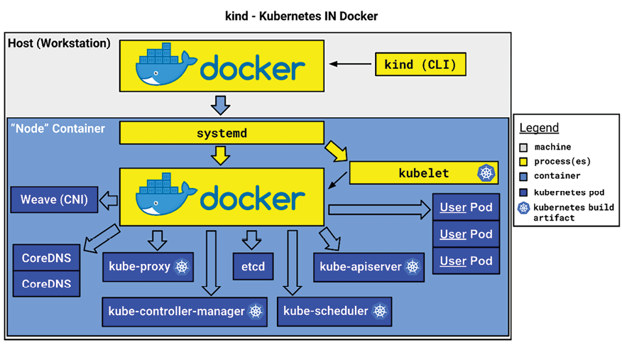

# kind (Kubernetes IN Docker)

`kind` is designed to run a Kubernetes cluster locally, just like minikube.

The whole idea behind kind is to use Docker or Podman containers as Kubernetes nodes, thanks to the Docker-in-Docker (DinD) / containers-in-container model. By launching containers that themselves contain the container engine and the kubelet, it is possible to make them behave as Kubernetes worker nodes.



This is exactly the same as using the Docker driver for minikube, except that there it is not done in a single container but in several. The result is a local multi-node cluster. Like minikube, kind is a free, open-source tool.

> ⚠️ **NOT FOR PRODUCTION**

## Contents

- [Installation](#installation)
- [Single-node cluster](#create-a-single-node-cluster)
- [Multi-node cluster](#multi-node-cluster)
- [Pinning a Kubernetes version](#pinning-a-kubernetes-version)
- [Inspecting the cluster](#inspecting-the-cluster)
- [Stopping and deleting](#stopping-and-deleting)

## Installation

```bash
curl -Lo ./kind https://kind.sigs.k8s.io/dl/v0.23.0/kind-linux-amd64
chmod +x ./kind
sudo mv ./kind /usr/local/bin/kind

# Check version
kind version
# kind v0.23.0 go1.21.10 linux/amd64
```

## Create a single-node cluster

```bash
kind create cluster --name test-kind
# Creating cluster "test-kind" ...
```

The result is a single-node Kubernetes cluster, with a Docker container acting as the control plane node.

Podman can be used as well. Just set the provider:

```bash
KIND_EXPERIMENTAL_PROVIDER=podman kind create cluster
```

## Multi-node cluster

To customize the cluster and its nodes, create a config file that serves as a template for kind to build your cluster, e.g. `~/.kube/kind_cluster`:

```yaml
kind: Cluster
apiVersion: kind.x-k8s.io/v1alpha4
nodes:
  - role: control-plane
  - role: worker
  - role: worker
  - role: worker
```

The `role` key takes one of two values: `control-plane` or `worker`.

Re-run `kind create cluster` with this config file. For the file above, the result is a **one-master, three-worker** Kubernetes cluster:

```bash
kind create cluster --config ~/.kube/kind_cluster
```

## Pinning a Kubernetes version

Build a specific Kubernetes version by passing the matching node image when creating the cluster:

```bash
kind create cluster \
  --name my-kind-cluster \
  --config ~/.kube/kind_cluster \
  --image kindest/node:v1.29.0@sha256:eaa1450915475849a73a9227b8f201df25e55e268e5d619312131292e324d570
```

By default, kind also generates your `~/.kube/config` file.

## Inspecting the cluster

View the nodes:

```bash
kubectl get nodes
```

Check the component statuses:

```bash
kubectl cluster-info
```

Further debug and diagnose cluster problems:

```bash
kubectl cluster-info dump
```

## Stopping and deleting

kind has no `stop` command. To stop the cluster while keeping its state, stop the node containers themselves:

```bash
docker stop <cluster-name>-control-plane <cluster-name>-worker ...
# or, to list them first:
docker ps --filter "name=<cluster-name>"
```

To completely remove a cluster from your system:

```bash
kind delete cluster --name test-kind
# Deleting cluster "test-kind" ...
```
